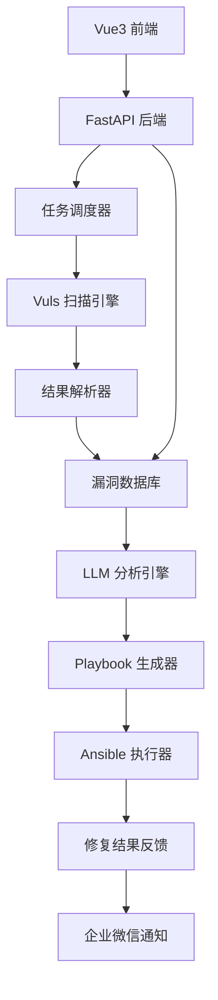

# FixPilot 自动化漏洞修复系统技术报告

## 1. 项目概述

### 1.1 背景与目标

随着网络安全威胁的日益增长，传统的手动漏洞修复方式已无法满足现代企业的安全需求。FixPilot 项目旨在构建一个基于 AI 的自动化漏洞修复系统，通过集成漏洞扫描、智能分析和自动化修复技术，实现从漏洞发现到修复的全流程自动化。

### 1.2 核心价值

- **效率提升**: 将传统需要数小时的手动修复过程缩短至分钟级别
- **准确性保障**: 基于 AI 的智能分析减少人为错误
- **规模化处理**: 支持大规模主机的并发漏洞修复
- **风险控制**: 内置回滚机制确保修复过程的安全性

## 2. 技术架构

### 2.1 整体架构设计



### 2.2 核心组件

#### 2.2.1 漏洞扫描层
- **技术选型**: Vuls (Go 语言开发的漏洞扫描器)
- **扫描模式**: 支持快速扫描和深度扫描
- **数据格式**: JSON 格式的结构化漏洞报告
- **扫描策略**: 基于 CVE 数据库的准确性扫描

#### 2.2.2 数据处理层
- **解析引擎**: Python + Pandas 数据处理
- **数据模型**: SQLAlchemy ORM 映射
- **存储方案**: SQLite (开发) / PostgreSQL (生产)
- **数据验证**: Pydantic 模型验证

#### 2.2.3 AI 分析层
- **在线模式**: OpenAI GPT-3.5/4 API
- **离线模式**: SecGPT-mini 1.5B 本地部署
- **提示工程**: 针对漏洞修复场景优化的 Prompt
- **回退机制**: 基于规则的模板生成

#### 2.2.4 自动化执行层
- **编排工具**: Ansible Playbook
- **模板引擎**: Jinja2 动态生成
- **执行策略**: 分批执行、失败重试
- **回滚支持**: 自动备份和恢复机制

### 2.3 技术栈选择

| 层级 | 技术 | 版本 | 选择理由 |
|------|------|------|----------|
| 前端 | Vue.js | 3.3+ | 现代化、响应式、生态丰富 |
| UI 框架 | Element Plus | 2.4+ | 企业级组件库、中文友好 |
| 样式 | TailwindCSS | 3.3+ | 原子化 CSS、快速开发 |
| 后端 | FastAPI | 0.104+ | 高性能、自动文档、类型安全 |
| 数据库 | SQLite/PostgreSQL | - | 轻量级开发、生产级扩展 |
| ORM | SQLAlchemy | 2.0+ | 成熟稳定、功能强大 |
| 任务队列 | Celery + Redis | - | 异步任务处理 |
| 容器化 | Docker | 20.10+ | 环境一致性、部署便利 |

## 3. 核心算法与实现

### 3.1 漏洞风险评估算法

```python
def calculate_risk_score(vulnerabilities):
    """
    计算主机风险评分
    考虑因素：CVSS 评分、漏洞数量、可修复性
    """
    total_cvss = sum(vuln.cvss for vuln in vulnerabilities)
    high_risk_count = len([v for v in vulnerabilities if v.cvss >= 7.0])
    patchable_count = len([v for v in vulnerabilities if v.patchable == 'yes'])
    
    # 加权计算
    base_score = total_cvss / len(vulnerabilities) if vulnerabilities else 0
    risk_multiplier = 1 + (high_risk_count * 0.2)
    patch_factor = 0.8 if patchable_count > len(vulnerabilities) * 0.5 else 1.0
    
    return min(base_score * risk_multiplier * patch_factor, 10.0)
```

### 3.2 LLM Prompt 优化策略

```python
SYSTEM_PROMPT = """
你是一个专业的 Linux 系统安全专家，专门负责生成漏洞修复命令。
请遵循以下原则：
1. 优先使用官方包管理器
2. 确保命令的安全性和准确性
3. 包含必要的服务重启步骤
4. 避免破坏性操作
"""

def build_fix_prompt(cve, summary, os_info, package):
    return f"""
CVE: {cve}
描述: {summary}
系统: {os_info}
受影响包: {package}

请生成修复此漏洞的 Shell 命令，要求：
- 使用适当的包管理器更新
- 包含服务重启（如需要）
- 确保命令的幂等性
- 只返回可执行的命令，不要解释
"""
```

### 3.3 Ansible Playbook 生成算法

```python
def generate_playbook_structure(host, issues):
    """
    生成 Ansible Playbook 结构
    包含：前置检查、备份、修复、验证、回滚
    """
    playbook = {
        'name': f'Fix vulnerabilities on {host.ip}',
        'hosts': host.ip,
        'become': True,
        'pre_tasks': generate_pre_tasks(),
        'tasks': generate_fix_tasks(issues),
        'post_tasks': generate_post_tasks(),
        'handlers': generate_handlers()
    }
    return playbook
```

## 4. 性能优化

### 4.1 扫描性能优化

- **并发扫描**: 支持多主机并发扫描，默认并发数为 5
- **增量扫描**: 基于时间戳的增量扫描机制
- **缓存机制**: CVE 数据库本地缓存，减少网络请求
- **资源限制**: 内存和 CPU 使用限制，避免系统过载

### 4.2 数据处理优化

- **批量处理**: 使用 Pandas 批量处理扫描结果
- **索引优化**: 数据库关键字段建立索引
- **连接池**: 数据库连接池管理，提高并发性能
- **异步处理**: FastAPI 异步处理提高响应速度

### 4.3 前端性能优化

- **代码分割**: Vite 自动代码分割和懒加载
- **组件缓存**: Vue3 组件级别的缓存策略
- **虚拟滚动**: 大数据量表格的虚拟滚动
- **CDN 加速**: 静态资源 CDN 分发

## 5. 安全设计

### 5.1 访问控制

- **身份认证**: JWT Token 认证机制
- **权限管理**: RBAC 角色权限控制
- **API 限流**: 基于 IP 和用户的请求限流
- **审计日志**: 完整的操作审计日志

### 5.2 数据安全

- **敏感信息加密**: SSH 密钥、API Key 等敏感信息加密存储
- **传输加密**: HTTPS/TLS 加密传输
- **数据备份**: 定期自动备份关键数据
- **权限最小化**: 容器和服务权限最小化原则

### 5.3 执行安全

- **沙箱执行**: Ansible 执行环境隔离
- **回滚机制**: 自动备份和快速回滚
- **执行审批**: 高风险操作需要人工审批
- **监控告警**: 实时监控执行状态和异常

## 6. 测试策略

### 6.1 单元测试

- **覆盖率要求**: 代码覆盖率 > 80%
- **测试框架**: pytest (后端) + Jest (前端)
- **模拟测试**: Mock 外部依赖和 API 调用
- **自动化执行**: CI/CD 流水线自动执行

### 6.2 集成测试

- **端到端测试**: 完整流程的自动化测试
- **性能测试**: 负载测试和压力测试
- **安全测试**: 漏洞扫描和渗透测试
- **兼容性测试**: 多操作系统和版本兼容性

### 6.3 测试环境

- **开发环境**: 本地 Docker 环境
- **测试环境**: 模拟生产的测试集群
- **预生产环境**: 生产数据的预发布验证
- **生产环境**: 灰度发布和监控

## 7. 部署与运维

### 7.1 部署架构

```yaml
# 生产环境部署架构
Production:
  LoadBalancer: Nginx
  Frontend: Vue3 SPA (CDN)
  Backend: FastAPI (多实例)
  Database: PostgreSQL (主从)
  Cache: Redis Cluster
  Queue: Celery + Redis
  Monitor: Prometheus + Grafana
```

### 7.2 监控体系

- **应用监控**: APM 性能监控
- **基础设施监控**: 服务器资源监控
- **业务监控**: 关键业务指标监控
- **日志聚合**: ELK 日志收集和分析

### 7.3 运维自动化

- **CI/CD 流水线**: GitLab CI 自动化部署
- **配置管理**: Ansible 配置管理
- **容器编排**: Kubernetes 生产部署
- **备份恢复**: 自动化备份和恢复策略

## 8. 项目管理

### 8.1 开发流程

- **敏捷开发**: 2 周迭代周期
- **代码审查**: Pull Request 强制审查
- **版本管理**: Git Flow 分支策略
- **文档同步**: 代码和文档同步更新

### 8.2 质量保证

- **代码规范**: ESLint + Black 代码格式化
- **静态分析**: SonarQube 代码质量分析
- **安全扫描**: 依赖漏洞扫描
- **性能基准**: 性能基准测试和回归

### 8.3 风险管理

- **技术风险**: 技术选型和架构风险评估
- **安全风险**: 安全威胁建模和防护
- **运营风险**: 业务连续性和灾难恢复
- **合规风险**: 数据保护和合规要求

## 9. 未来规划

### 9.1 功能扩展

- **多云支持**: AWS、Azure、阿里云等多云环境
- **容器安全**: Docker、Kubernetes 容器漏洞扫描
- **合规检查**: 等保、ISO27001 等合规标准检查
- **威胁情报**: 集成外部威胁情报源

### 9.2 技术演进

- **AI 增强**: 更先进的 AI 模型和算法
- **边缘计算**: 边缘节点的分布式扫描
- **实时处理**: 流式数据处理和实时响应
- **智能运维**: AIOps 智能运维能力

### 9.3 生态建设

- **插件体系**: 可扩展的插件架构
- **API 开放**: 开放 API 生态建设
- **社区建设**: 开源社区和用户生态
- **商业化**: 企业级功能和服务

## 10. 总结

FixPilot 项目通过创新的技术架构和 AI 驱动的自动化方案，为企业提供了一个高效、安全、可扩展的漏洞修复解决方案。项目在技术实现、安全设计、性能优化等方面都采用了业界最佳实践，具有良好的可维护性和扩展性。

随着网络安全威胁的不断演进，FixPilot 将持续优化和升级，为用户提供更加智能和高效的安全防护能力。
